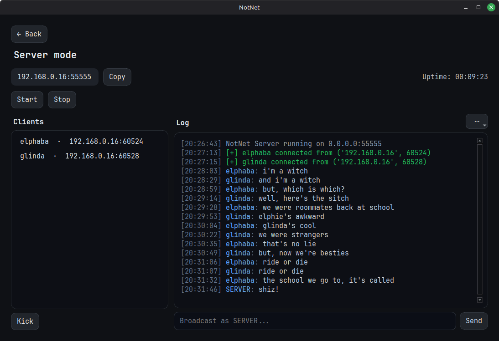
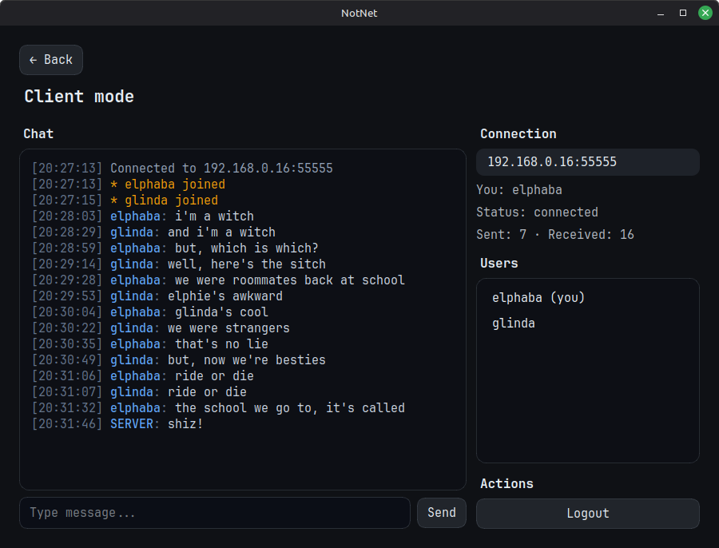
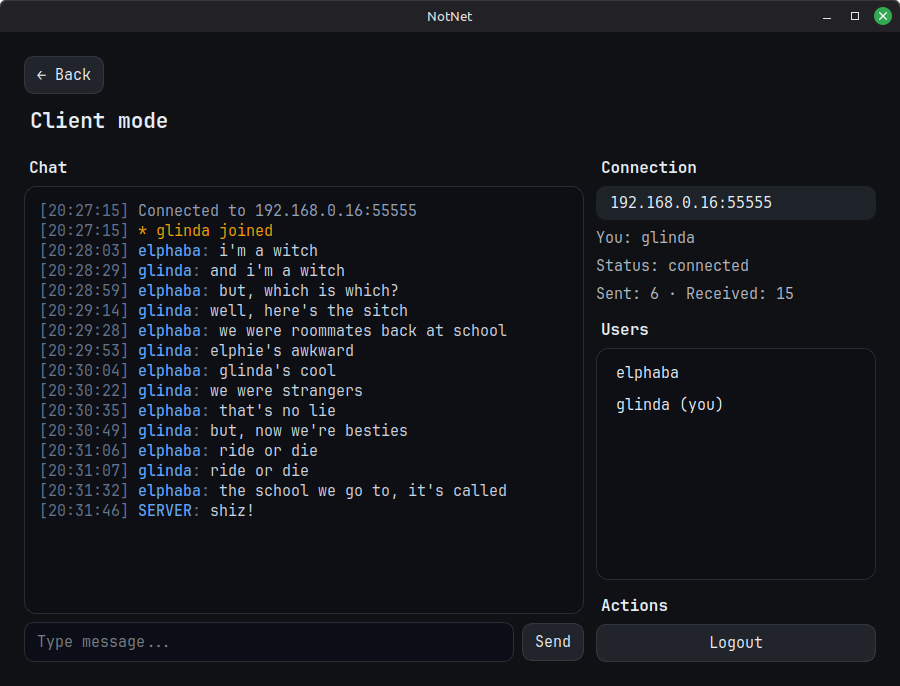

# NotNet

🇬🇧 [English](README_en.md)

NotNet — это мессенджер для общения в локальной сети без интернета.
Без аккаунтов. Без облаков. Без внешних серверов.

## Скриншоты

<p align="center">
  <a href="assets/server-fullscreen.png">
    
  </a>
</p>

<p align="center">
  <a href="assets/elphaba.png">
    
  </a>
  <a href="assets/glinda.png">
    
  </a>
</p>

## Установка

Скачайте архив из последнего [релиза](https://github.com/oguzokdotdev/notnet-messenger/releases/latest) и распакуйте его.

### На Linux
```bash
tar -xvzf notnet-v1.1.0-linux-amd64.tar.gz
```

### На Windows
Используйте 7-Zip, WinRAR или любой другой архиватор.

---

## Руководство пользователя

Запустите NotNet и выберите режим:

- **Server** — запуск локального сервера
- **Client** — подключение к серверу по локальному IP-адресу.

---

## Примечания
- Работает только в одной локальной сети.
- Нет привязки к внешним серверам.
- Сообщения не выходят за пределы локальной сети.

---

## Лицензия

GPL-3.0